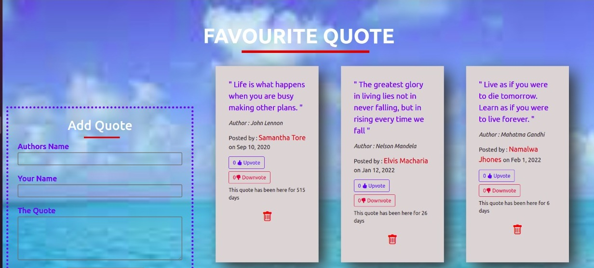
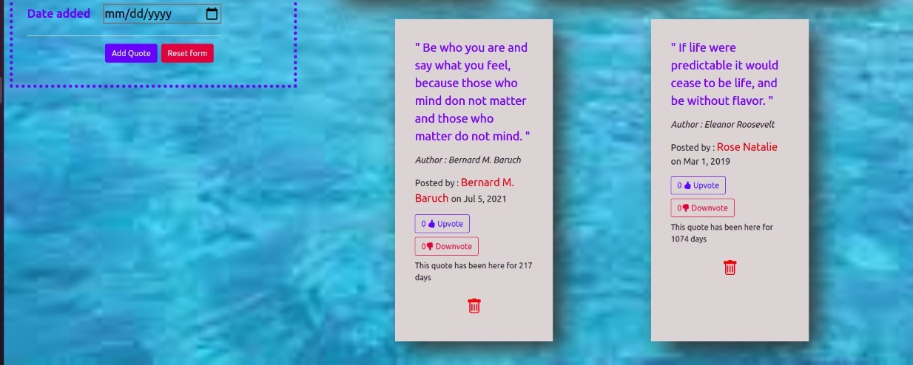

# QuotesApp

This project was generated with [Angular CLI](https://github.com/angular/angular-cli) version 13.1.4.

## Author
Memory Wabwile 
 https://github.com/Memory-Wabwile

## Description
My Quotes App is an application that allows users to read the quotes on the browser, to upvote and downvote on the quotes, to add their own quotes and also to delete quotes.

## Live Page 
https://memory-wabwile.github.io/Quotes-App/

## Design
Landing page of the Quotes-App 

## Technologies Used

1. HTML5 for front end 
2. CSS for styling 
3. Bootstrap for responsiveness 
4. Angular CLI for functionality 

## Known Bugs
Highlight property directive doesn't work on the cards

## Installation / Setup instruction
To clone this repository , open the terminal then copy and run the following code 
<li> git clone https://memory-wabwile.github.io/Quotes-App/ </li>
<li> cd QuotesApp</li>
<li> code .</li>

## Development server

Run `ng serve` for a dev server. Navigate to `http://localhost:4200/`. The app will automatically reload if you change any of the source files.

## Code scaffolding

Run `ng generate component component-name` to generate a new component. You can also use `ng generate directive|pipe|service|class|guard|interface|enum|module`.

## Build

Run `ng build` to build the project. The build artifacts will be stored in the `dist/` directory.

## Running unit tests

Run `ng test` to execute the unit tests via [Karma](https://karma-runner.github.io).

## Running end-to-end tests

Run `ng e2e` to execute the end-to-end tests via a platform of your choice. To use this command, you need to first add a package that implements end-to-end testing capabilities.

## Further help

To get more help on the Angular CLI use `ng help` or go check out the [Angular CLI Overview and Command Reference](https://angular.io/cli) page.

## Contact Information
For any querries email me at memorywabwile@gmail.com

## License
Copyright (c) {2021} *{Wabwile Memory}*

Permission is hereby granted, free of charge, to any person obtaining a copy
of this software and associated documentation files (the "Software"), to deal
in the Software without restriction, including without limitation the rights
to use, copy, modify, merge, publish, distribute, sublicense, and/or sell
copies of the Software, and to permit persons to whom the Software is
furnished to do so, subject to the following conditions:

The above copyright notice and this permission notice shall be included in all
copies or substantial portions of the Software.